# WEEK 6 — BUILD, INTEGRATION AND TESTING CLINIC REPORT

**Course:** Technology Applications in Banking and Finance (NHA408E) - FTU 2026  
**Project:** Free Fall 2.0 (Group 6)  
**Technical Lead & Engine Architect:** Nguyễn Quang Minh (MSSV: 2412380031)  
**Deliverable Type:** Operational Working Product, Integration Audit, Test Suite & Bug Log  
**Checkpoint 6 Status:** Demo-ready, Financially Verified, Scope Frozen  

---

## 1. Executive Summary & Operational Product Definition

In accordance with Week 6 standards (*Slide 6: "Prototype vs Working Product"*), **Free Fall 2.0** has transitioned from conceptual layouts into an **operational working product**:
- **Accepts Real Inputs:** Liquid starting capital ($10,000 USD), housing target multipliers (3x, 20x, 100x), margin borrowing tiers (1.0x, 2.0x, 4.0x), and order executions.
- **Executes Deterministic Financial Logic:** Live dynamic Net Worth valuation, debt compounding, margin ratio calculations, settlement queue processing, and automated forced liquidation.
- **Drives Explainable Outputs:** Continuous HUD updates, real-time warning alerts, and behavioral performance debriefs.
- **Dual-Mode Deployment:**
  - **Online Standalone (Zero-Dependency):** GitHub Pages with Client-side Hybrid Engine (`index.html`).
  - **Local Backend (Full Architecture):** Lightweight Python HTTP REST API Server (`api_server.py`) serving live state to web and CLI interfaces.

---

## 2. End-to-End Technical Integration Flow

The diagram below demonstrates how components connect technically without breaking assumptions (*Slide 7 & 12*):

```mermaid
flowchart TD
    subgraph ClientLayer ["1. Client Interface (index.html / my-app)"]
        UI_In[User Action: Order / Target / Bank Transfer]
        HUD[Dynamic HUD: Equity, Leverage, Margin Ratio, Health Gauge]
        Modal[Emergency Warning & Liquidation Modal]
    end

    subgraph TransportLayer ["2. Transport / Bridge (Hybrid / api_server.py)"]
        REST_Post["POST /api/trade, /api/savings, /api/advance"]
        REST_Get["GET /api/state"]
    end

    subgraph EngineLayer ["3. Core Financial Logic (src/simulation_engine.py)"]
        Valuation["Portfolio Valuation: Σ(Shares_i × Price_i) + Savings"]
        RatioCalc["Margin Ratio = Equity / Stock Value"]
        Settlement["Settlement Delay Pen: T+0.5 vs Phase 2 Delivery"]
        LiqTrigger{"Margin Ratio < 20%?"}
        LiqExec["Auto Fire-sale + 5% Liquidation Penalty"]
    end

    subgraph DataLayer ["4. Market Scenario Dataset (market scenario/)"]
        CSV[market_scenario.csv: 1,800 ticks, 50 Korean Assets]
        Bench[best_case_portfolio_summary.csv: Multipliers Calibration]
    end

    UI_In -->|JSON payload| REST_Post
    REST_Post --> EngineLayer
    CSV -->|Stream Prices| EngineLayer
    EngineLayer --> Valuation
    Valuation --> RatioCalc
    RatioCalc --> LiqTrigger
    LiqTrigger -->|No| REST_Get
    LiqTrigger -->|Yes| LiqExec --> REST_Get
    REST_Get -->|State Payload| HUD
    LiqExec -->|Alert Event| Modal
```

---

## 3. Integration Audit Checklist (Slide 12 - 14)

| Checkpoint Connection | Expected Behavior | Actual Behavior | Audit Status |
|---|---|---|:---:|
| **Field Name Matching** | Frontend keys (`ticker`, `action`, `shares`, `use_margin`) match Backend engine parameter signatures. | Parameter parsing verified in `api_server.py` and `simulation_engine.py`. | **PASS** |
| **Unit Consistency** | All account balances, stock prices, and target values evaluated in USD currency. | Consistent USD unit scale applied across UI and CSV price ticks. | **PASS** |
| **Data Type Matching** | Shares and Prices parsed as floats; actions normalized to uppercase strings. | Guardrails added to prevent string concatenation or type errors. | **PASS** |
| **Dataset Loading** | `market_scenario.csv` loads 1,800 ticks across 50 Korean equity tickers. | Verified via `src/game_controller.py` with fallback to `data/market_scenario.json`. | **PASS** |
| **Deployment Independence** | Product executes seamlessly on static web host (GitHub Pages). | Embedded Base64 visual assets and Client-side Hybrid Engine ensure 100% offline/static survival. | **PASS** |
| **Fallback Architecture** | Python terminal demo runs independently if web UI fails. | `interactive_demo.py` functions standalone with full logic. | **PASS** |

---

## 4. Formal Test Table with Ownership (Slide 16 - 19)

Every test case compares **Approved Expected Financial Logic** against **Actual Software Output**, with assigned author, fixer, and verifier.

| ID | Category | Test Case & Inputs | Expected Result | Actual Result | Status | Author | Fixer | Verifier |
|:---:|:---:|---|---|---|:---:|:---:|:---:|:---:|
| **T01** | **Normal** | Capital $10k, 1.0x Cash, Buy $5,000 Vintrumite, Market flat. | Cash $5k, Equity $10k, Margin Debt $0, Margin Ratio 200% ($10k equity / $5k position), Status `HEALTHY`. | Cash $5,000, Debt $0, Ratio 200%, Healthy. | **PASS** | Minh | N/A | Dụ |
| **T02** | **Normal** | Capital $10k, 4.0x Margin, Buy $40k position (Debt $30k), Deposit $0 to Bank. | Cash $0, Debt $30k, Equity $10k, Leverage 4.0x, Margin Ratio 25.0%, Status `NORMAL`. | Cash $0, Debt $30k, Ratio 25.0%, Normal. | **PASS** | Minh | N/A | Dụ |
| **T03** | **Boundary** | Position $40k (Debt $30k). Price drops exactly -6.25% to $37,500. | Equity = $7,500. Margin Ratio = 7,500 / 37,500 = **20.00%** (Exactly on maintenance floor, no liquidation yet). | Margin Ratio = 20.00%, Status `WARNING`, No liquidation. | **PASS** | Minh | Minh | Dụ |
| **T04** | **Boundary** | Position $40k (Debt $30k). Price drops -6.26% to $37,496. | Equity = $7,496. Margin Ratio = 19.99% (< 20.0%). Auto forced liquidation triggered immediately. | Margin Call triggered, `trigger_forced_liquidation()` executed. | **PASS** | Minh | Minh | Dụ |
| **T05** | **Invalid** | Capital $10k, 4x Tier (Max Power $40k). Player attempts BUY order of $50,000. | Order rejected with `[REJECTED] Exceeds buying power`. Cash remains intact. No `NaN` or crash. | Order returns `False`, state unmodified. | **PASS** | Minh | Minh | Lương |
| **T06** | **Invalid** | Player owns 0 shares of Samsung, attempts to execute SELL 10 shares. | Order rejected with `[REJECTED] Insufficient holdings`. State unmodified. | Order returns `False`, state unmodified. | **PASS** | Minh | Minh | Lương |
| **T07** | **Invalid** | Negative shares entered (Shares = -50). | Engine raises `ValueError` before state mutation. | `ValueError` caught and handled cleanly. | **PASS** | Minh | Minh | Lương |
| **T08** | **Financial** | High Leverage Wipeout (Week 4 Spec): Capital $10m KRW, Debt $30m KRW, Shock -20%, 5% Liquidation Penalty. | Gross proceeds $32m, Penalty $1.6m, Net $30.4m, Debt settled ($30m), Final Equity $400k KRW. | Exact numeric match to hand-calculated model. | **PASS** | Minh | Minh | Dụ |
| **T09** | **Financial** | Safe Haven Bank Integration: Deposit $4k to Bank Savings. Stocks drop -50%. | Savings retain 100% nominal value ($4k). Immune to stock price markdown. | Bank savings = $4,000, Total Portfolio includes savings. | **PASS** | Minh | Minh | Dụ |
| **T10** | **Workflow** | Order placed at Tick 50 (T < 150) vs Tick 200 (T >= 150). | Tick 50 delivered in Phase 1 (T+30); Tick 200 delivered upon Phase 2 entry. | Deliveries queued and converted exactly as scheduled. | **PASS** | Minh | Minh | Khánh |

---

## 5. Bug Triage and Resolution Log (Slide 20 - 22)

| Bug ID | Severity | What Happened & Where | Root Cause | Fix Applied | Status | Owner |
|:---:|:---:|---|---|---|:---:|:---:|
| **BUG-01** | **CRITICAL** | Relative image paths (`assets/house_small.jpg`) failed with 404 errors on GitHub Pages subpath deployment. | GitHub Pages runs on `/<repo-name>/`, causing relative asset lookups to resolve to root domain. | Converted house images into embedded Base64 data URIs directly inside `index.html`. | **FIXED** | Minh |
| **BUG-02** | **CRITICAL** | Delivery queue for orders placed after Tick 150 did not convert to active holdings in Phase 2. | Delivery check required both `phase >= target_phase` AND `tick >= delivery_tick`, failing on Phase 2 start tick reset. | Refactored `should_deliver` condition in `src/simulation_engine.py` to evaluate phase advancement independently. | **FIXED** | Minh |
| **BUG-03** | **MAJOR** | Floating point rounding caused margin ratio display to produce trailing decimals (e.g., `24.999999999%`). | Raw IEEE 754 float division without explicit display rounding. | Added `round(margin_ratio, 2)` formatting in both Python engine and JS HUD refresh. | **FIXED** | Minh |
| **BUG-04** | **MAJOR** | Attempting to trade after account liquidation caused unhandled exceptions in client UI. | Lack of explicit pre-trade state guard checking `is_liquidated`. | Added guard condition throwing `RuntimeError` with user-friendly error response payload. | **FIXED** | Minh |
| **BUG-05** | **MINOR** | Root repository contained loose background PNG images (`bg_base.png`, `bg_reveal.png`), causing repo clutter. | Initial deployment placed images in root for testing. | Cleanly migrated images into `assets/` and updated HTML reference tags. | **FIXED** | Minh |

---

## 6. Scope Freeze Declaration (Slide 23)

> **OFFICIAL SCOPE FREEZE DATE: Week 6 Clinic Session**  
> To guarantee stability, eliminate regression risks, and prepare rigorous assessment evidence for Week 7 (Final QA), Group 6 declares an **Absolute Feature Freeze**:
> - **FROZEN (No New Additions):** No new asset classes, no order-book depth queues, no cryptocurrency pairs, and no additional cosmetic customization.
> - **PERMITTED WORK ONLY:** Bug fixes identified during testing, documentation refinement, and individual footprint verification.
